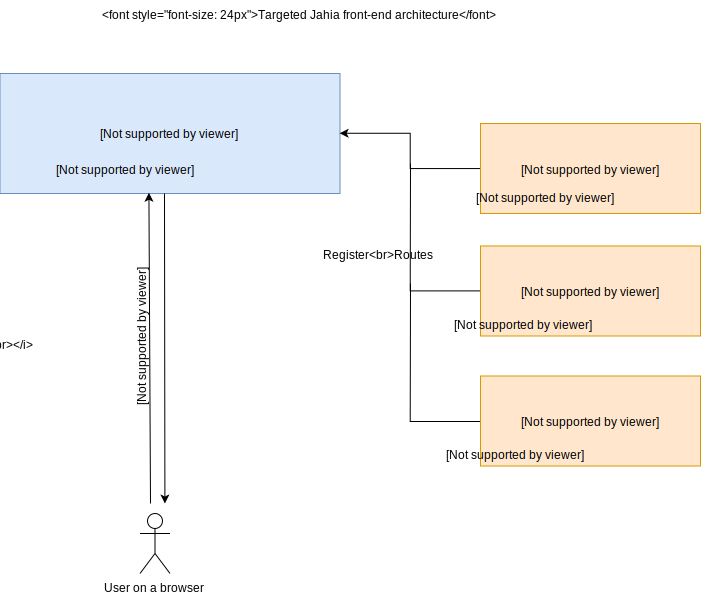

<h1 align="center">Welcome to @jahia/app-shell 👋</h1>

  
  

> Root Jahia app

This project is the root of the jahia micro-frontends.

The app-shell micro-frontends approach allow to:

 - Have Independent deployment between modules
 - Simple, decoupled codebases
 - Share dependencies between projects
 - Have Autonomous team

This app shell rely on React, so if you want to add new modules, new routes it should be written in React.

<detail>
<h2>Architecture</h2>

</detail>

### Registry

There is two main registry in Jahia:
 - the module registry. It registry JS apps via a entry in `package.js`.
 - the ui-extender registry. It allow to extend this app-shell to add new root, new buttons, modify some behavior, ...

### FAQ

- [How to declare a new module?](./docs/declare-new-module.md)
- [How to extends the UI](./docs/extend-ui.md)
- [How to add a loading screen to the app?](./docs/loading-screen.md)

## Core dependencies of Jahia

This module provide shared dependencies using [dll](https://webpack.js.org/plugins/dll-plugin/) for webpacked JS application. These components will be used by webpack.

To avoid dependency duplication into Jahia, this project reference all dependencies shared by all Jahia projects.

Each dependency in `dependencies` section of the `package.json` _MUST_ be registered in the entry part of webpack.libraries.config.js.

## Author

👤 **Jahia**

* Website: https://www.jahia.com
* Twitter: [@Jahia](https://twitter.com/Jahia)
* Github: [@Jahia](https://github.com/Jahia)

## 🤝 Contributing

Contributions, issues and feature requests are welcome! Feel free to check [issues page](https://jira.jahia.com).

## Show your support

Give a ⭐️ if this project helped you!

## 📝 License

Copyright © 2020 [Jahia](https://github.com/Jahia). 
This project is [JAHIA'S DUAL LICENSING](./LICENSE.txt) licensed.

***
_This README was generated with ❤️ by [readme-md-generator](https://github.com/kefranabg/readme-md-generator)_
