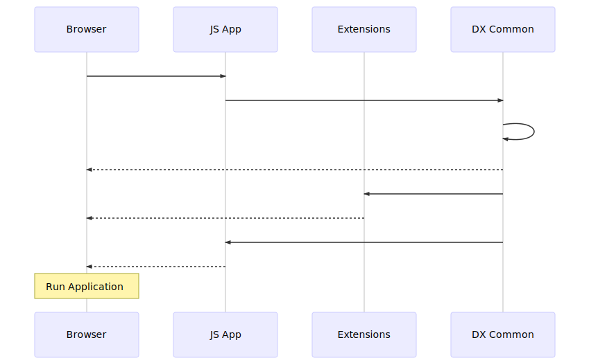

# JavaScript Execution Sequence


[source][webpack-common-execution-sequence]

**explanations:**
The call to `bootstrap()` will first load all the shared js modules provided by `DX Common Webpack`

In `/dx-commons-webpack/src/main/resources/javascript/js-load.js`:

```
var scriptTag = document.createElement('script');
    scriptTag.src = window.contextJsParameters.contextPath + '/modules/dx-commons-webpack/javascript/apps/commons.bundle.js';
```

Then load all the extensions

In `/dx-commons-webpack/src/javascript/main.js`:

```
    let jsloads = js.slice(0, js.length - 1).map(path => {
        return jsload(path);
    });
```

To finally loads the application itself:

```
    Promise.all(jsloads).then(() => {
        jsload(js.slice(js.length - 1));
    });
```

Once everything is loaded, the application works as if all resources were provided by one single module.

The module `dx-common-webpack` will provide a manifest `dx-commons-webpack-x.x.x-SNAPSHOT-manifest.json` that will be used by application and extensions to know the shared packages.
The packages provided by the module are those defined in `/dx-commons-webpack/src/javascript/main.js` as `require` statement:

```
require('@jahia/apollo-dx');
require('@jahia/design-system-kit');
require('@jahia/i18next');
require('@jahia/icons');
require('@jahia/react-apollo');
require('@jahia/react-material');
require('@jahia/registry');
```

[webpack-common-execution-sequence]: https://mermaidjs.github.io/mermaid-live-editor/#/edit/eyJjb2RlIjoic2VxdWVuY2VEaWFncmFtXG5QYXJ0aWNpcGFudCBicm93c2VyIGFzIEJyb3dzZXJcblBhcnRpY2lwYW50IHJlYWN0IGFzIEpTIEFwcFxuUGFydGljaXBhbnQgZXh0ZW5zaW9ucyBhcyBFeHRlbnNpb25zXG5QYXJ0aWNpcGFudCBsb2FkZXIgYXMgRFggQ29tbW9uXG4gXG5icm93c2VyLT4-cmVhY3Q6IHN0YXJ0XG5yZWFjdC0-PmxvYWRlcjogYm9vdHN0cmFwKG1vZHVsZXMgdG8gbG9hZClcbmxvYWRlci0-PmxvYWRlcjogTG9hZCBzaGFyZWQgcGFja2FnZXNcbmxvYWRlci0tPj5icm93c2VyOiBzaGFyZWQgcGFja2FnZXMgbG9hZGVkXG5sb2FkZXItPj5leHRlbnNpb25zOiBsb2FkIGV4dGVuc2lvbnNcbmV4dGVuc2lvbnMtLT4-YnJvd3NlcjogRXh0ZW5zaW9ucyBsb2FkZWRcbmxvYWRlci0-PnJlYWN0OiBsb2FkIHBhY2thZ2VzIGFwcGxpY2F0aW9uXG5yZWFjdC0tPj5icm93c2VyOiBhcHBsaWNhdGlvbiBMb2FkZWRcbk5vdGUgb3ZlciBicm93c2VyOiBSdW4gQXBwbGljYXRpb25cbiAgICAiLCJtZXJtYWlkIjp7InRoZW1lIjoiZGVmYXVsdCJ9fQ
